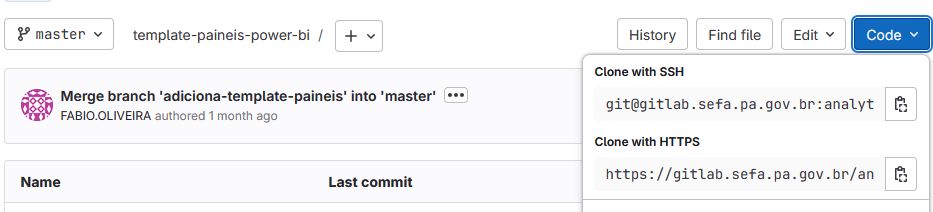

# 🚀 Fluxo Principal de Contribuição

Este arquivo tem como objetivo principal estabelecer um fluxo padronizado para o desenvolvimento colaborativo garantindo um versionamento seguro, publicação controlada e colaboração eficiente.

## 1. Preparação do Ambiente

### 1.1. Crie uma pasta para o projeto

Para iniciar o desenvolvimento do seu projeto, crie uma pasta com o nome de sua preferência e prossiga para o clone do repositório remoto _master_ para recebimento dos arquivos:
`cd ~/nome_da_pasta`

### 1.2. Clone o repositório remoto

Dentro dessa pasta, faça o clone do repositório remoto:

- No GitLab, procure o ícone `code`, e selecione a opção de _clone with HTTPS_:



- Na pasta criada anteriormente, com o terminal aberto, digite o comando:

```bash
git clone <git@exemplo.teste.etc> -- aqui é o HTTPS
cd nome-do-projeto
```

- Após o clone, é importante assegurar que está com a versão mais recente da branch. Isso pode ser feito por meio dos comandos abaixo:

```bash
# 1. Atualize com a branch de produção, assegurando que está com a versão mais recente
git checkout master
git pull origin master
```

### 1.3. Crie a nova branch

- Comando para criar a branch:

```bash
git checkout -b desenvolvimento
```

- Você pode verificar se está na branch correta com o comando:

```bash
git branch
```

Deve exibir com *:

```bash
* type/nome-da-branch
```

### 2. Publicar as alterações/commits

Após a criação da branch, continue o desenvolvimento das suas alterações e salve o arquivo. Com o arquivo alterado, pode verificar se há algo para adicionar no seu repositório, com o comando: `git status`, se sim, adicione no repositório com o comando `git add .` e prepare-se para o commit.
  
  Para isso, deve-se dispor de uma linguagem coerente e padronizada ajuda a todos os envolvidos no projeto a entenderem as mudanças ocorridas e quais contextos foram afetados.
A convenção adotada é a _conventional commits_, que segue as regras de:

- `test`: indica qualquer tipo de criação ou alteração de códigos de teste
  - Exemplo: Criação de testes unitários.
- `feat`: indica o desenvolvimento de uma nova feature ao projeto.
  - Exemplo: Acréscimo de um serviço, funcionalidade, endpoint, etc.
- `refactor`: usado quando houver uma refatoração de código que não tenha qualquer tipo de impacto na lógica/regras de negócio do sistema.
  - Exemplo: Mudanças de código após um code review
- `style`: empregado quando há mudanças de formatação e estilo do código que não alteram o sistema de nenhuma forma.
  - Exemplo: Mudar o style-guide, mudar de convenção lint, arrumar indentações, remover espaços em brancos, remover comentários, etc..
- `fix`: utilizado quando há correção de erros que estão gerando bugs no sistema.
  - Exemplo: Aplicar tratativa para uma função que não está tendo o comportamento esperado e retornando erro.
- `chore`: indica mudanças no projeto que não afetem o sistema ou arquivos de testes. São mudanças de desenvolvimento.
  - Exemplo: Mudar regras do eslint, adicionar prettier, adicionar mais extensões de arquivos ao .gitignore
- `docs`: usado quando há mudanças na documentação do projeto.
  - Exemplo: adicionar informações na documentação da API, mudar o README, etc.
- `build`: utilizada para indicar mudanças que afetam o processo de build do projeto ou dependências externas.
  - Exemplo: Gulp, adicionar/remover dependências do npm, etc.
- `perf`: indica uma alteração que melhorou a performance do sistema.
  - Exemplo: alterar ForEach por while, melhorar a query ao banco, etc.
- `ci`: utilizada para mudanças nos arquivos de configuração de CI.
  - Exemplo: Circle, Travis, BrowserStack, etc.
- `revert`: indica a reversão de um commit anterior.

#### Para mais informações, acesse o link nas referências

``` bash
# 3. Faça suas alterações e commits
git commit -m "type: descrição concisa e exata das mudanças"
```

## 3. Envio das alterações para a branch de **Homologação**

Tem como objetivo enviar seus commits locais para a branch remoto e disponibilizar o código para criação do merge request.

``` bash
git push 
```

## 4. Criação do Pull Request para Homologação

### Criação do Pull Request (PR)

Após o desenvolvimento as alterações, é necessário realizar o _pull request_ das alterações, a fim de unificar com a branch de homologação e permitir que sejam validadas as alterações feitas.
Para isso, é necessário que:

- Acesse o GitLab, vá para a sua branch;

- Clique em "**pull request**";

- Configure: source = sua branch (exemplo: feature/nome-da-feature) - target = branch de homologação;

- Link a pessoa que irá fazer o code review

- Crie o Pull Request (PR)

- Aguarde aprovação do PR.